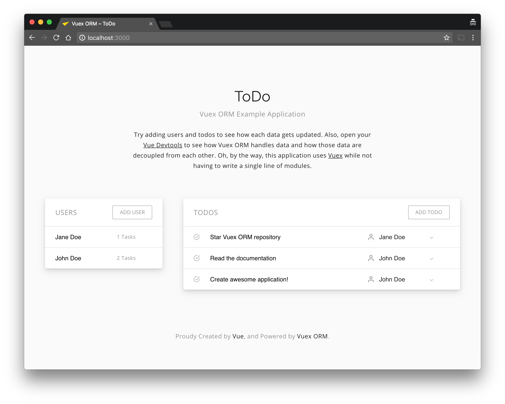

# Vuex ORM Examples

The example application to demonstrate the use case of the [Vuex ORM](https://github.com/revolver-app/vuex-orm). It's a simple ToDo application which can add assignee to each todo. You can see how Vuex ORM connects those two models – Todo and Assignee – and how to create, edit and delete them.



## Running The Example

Clone this repository and then run following commands.

```bash
$ npm install
$ npm run serve

# Or with yarn.

$ yarn install
$ yarn serve
```

Then you can access http://localhost:3000 to play with the app!

## Contribution

If you have any idea to make this example application easier to understand to people who are new to the Vuex ORM, please open an issue, or pull request :tada:
